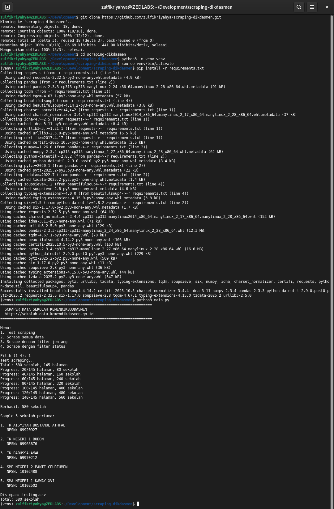

# SCRAPER DATA SEKOLAH KEMENDIKBUDDASMEN

Proyek ini bertujuan untuk melakukan scraping data sekolah dari situs resmi Direktorat Jenderal Pendidikan Dasar dan Menengah (Dikdasmen) Kemendikbud RI: [https://sekolah.data.kemendikdasmen.go.id](https://sekolah.data.kemendikdasmen.go.id). Data yang diambil meliputi informasi sekolah berdasarkan wilayah, jenjang pendidikan, dan status sekolah.

---



---

## Fitur

- Scraping data sekolah berdasarkan kabupaten/kota
- Filter berdasarkan jenjang pendidikan dan status sekolah
- Menyimpan hasil scraping dalam format CSV atau JSON
- Menampilkan progress scraping dengan `tqdm`
- Menu interaktif berbasis terminal

## Instalasi dan Setup Awal

1. Clone repositori:

   ```bash
   git clone https://github.com/zulfikriyahya/scraping-dikdasmen.git
   cd scraping-dikdasmen
   ```

2. Buat dan aktifkan virtual environment:

   ```bash
   python3 -m venv venv
   source venv/bin/activate
   ```

3. Instal dependensi:

   ```bash
   pip install -r requirements.txt
   ```

## Cara Penggunaan

Jalankan program utama dan pilih menu sesuai kebutuhan:

```bash
python3 main.py
```

Contoh tampilan:

```
======================================================================
  SCRAPER DATA SEKOLAH KEMENDIKBUDDASMEN
  https://sekolah.data.kemendikdasmen.go.id
======================================================================

Menu:
1. Test scraping
2. Scrape semua data
3. Scrape dengan filter jenjang
4. Scrape dengan filter status

Pilih (1-4):
```

## Catatan

- Data yang diambil bersifat publik dan tersedia di situs Kemendikbud.
- Perubahan struktur HTML situs sumber dapat memengaruhi hasil scraping.
- Gunakan proyek ini sesuai dengan etika dan ketentuan penggunaan data.
